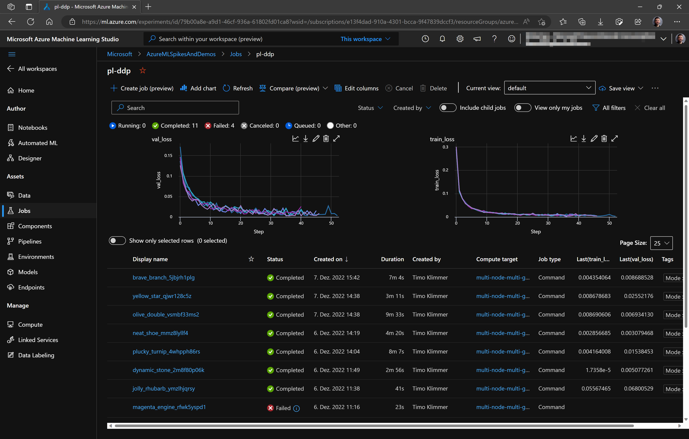

# Lightning on Azure Machine Learning v2

Demonstrates the use of PyTorch Lightning on Azure Machine Learning (CLI v2).

Usage:

1. Get an Azure ML workspace.

2. Ensure that you have got the Azure CLI and the corresponding ml extension installed on your machine. Alternatively,
   you can use an Azure ML Compute Instance as your dev machine. This gives the advantage that you can develop on a
   machine that has a maybe required GPU model built in. If you don't have an Ubuntu system at hand, it's also a good
   means to get access to an Ubuntu box.

3. Clone the repo and open the code in an editor of your choice. For best usability, VS.Code or VS.Code for Web are
   recommended, though.

4. Optional customization:
   - for a custom dataset, place a LightningDataModule script into folder 'data' (similar to MNIST.py).
   - for a custom model, place a LightningModule script into folder 'models' (similar to ImageClassifier.py).
   - to support model/data module authoring, you can setup a Python environment with all packages required by running
     `conda env create -n laml --file conda-dev.yaml`.
   - when submitting a job to Azure ML, you may need to adjust the corresponding `train_*.yaml` file before. especially,
     you may also need to create an Azure ML compute cluster and/or create a custom environment.

5. Either run the `train_local_ddp_no_debug.sh` script from a terminal to train a model locally, or run any of the
   `train_*.yaml` files by clicking the Azure ML icon on top right in VS.Code to train a model in AzureML. Note that you
   need the Azure Machine Learning extension installed in VS.Code to make this button available. Alternatively, run a
   `az ml job create -g <resource_group> -w <workspace> --file <yaml file> --stream` command in your command line. To
   debug, you can use VS.Code's launch configurations, e. g. `Debug local DDP`.

7. Open Azure ML Studio / Jobs and watch the training job progress.

The code provided uses mlflow autologging.

As always, feel free to use but don't blame me/us if things go wrong.
